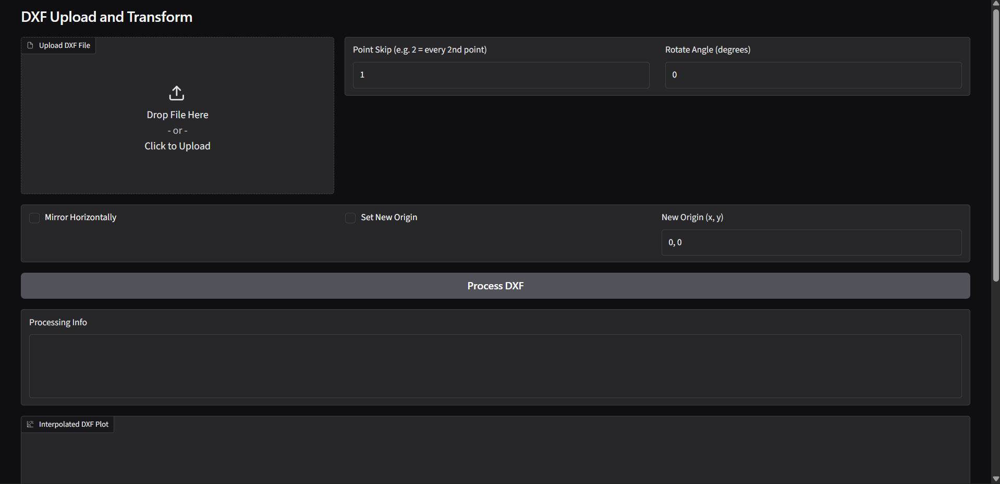
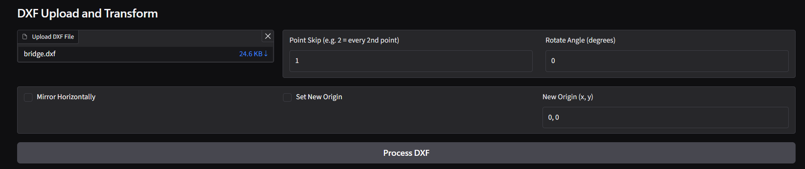
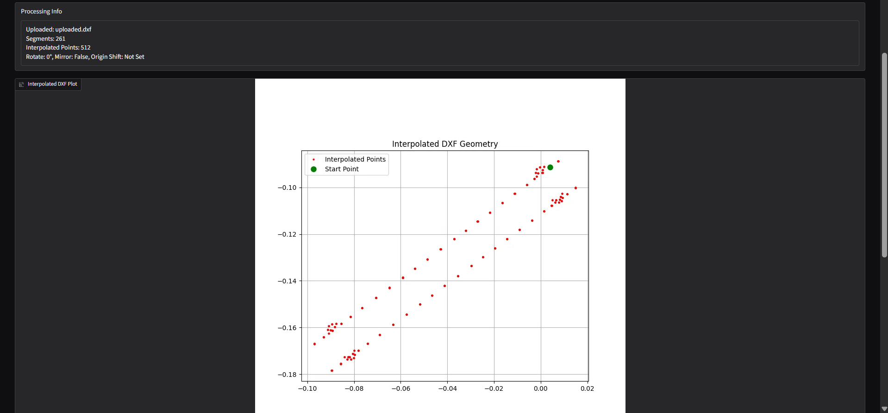
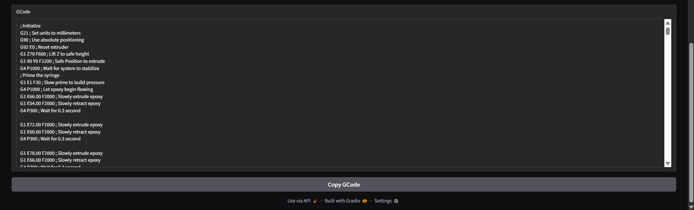

# dxf-to-gcode-generator
A DXF-to-G-code converter that generates machine motion commands from DXF geometry. The G-code template is predefined, with coordinate values dynamically generated from the input sketch. The generated output can be adapted for various CNC, plotting, dispensing, or automated motion-control applications.

### Steps to utilise the tool
- Open the terminal in the source directory
- Create the python virtual environment
```bash
# Windows
py -m venv venv

# Linux/macOS
python3 -m venv venv
```
- Activate virtual environment
```bash
# Windows (PowerShell)
.\venv\Scripts\Activate.ps1

# Windows (CMD)
venv\Scripts\activate.bat

# Linux/macOS
source venv/bin/activate
```
- Install required libraries
```bash
pip install -r requirements.txt
```

- Run the server.py and open the link provided (Try both the links that gradio server in case one does not work)
```bash
python server.py
```

- Upload the .dxf file in the UI


- Apply parameters as required and press Process DXF

- Copy the GCode from the section at the bottom of the page


### Steps to make modifications to the generated gcode
- Open dxf_tool.py
- Make changes to generate_gcode function to create custom gcode sequence (Current example is given for a personal usecase)

```python
# gcode generator
def generate_gcode(points):
    gcode = []

    # === Initialization ===
    gcode.append("; Initialize")
    gcode.append("G21 ; Set units to millimeters")
    gcode.append("G90 ; Use absolute positioning")
    gcode.append("G92 E0 ; Reset extruder")
    gcode.append("G1 Z70 F600 ; Lift Z to safe height")
    gcode.append("G1 X0 Y0 F1200 ; Safe Position to extrude")
    gcode.append("G4 P1000 ; Wait for system to stabilize")

    # === Prime the epoxy ===
    gcode.append("; Prime the syringe")
    gcode.append("G1 E1 F30 ; Slow prime to build pressure")
    gcode.append("G4 P1000 ; Let epoxy begin flowing")

    # === Dispense at each point ===
    ext = 60 # Start from primed value
    extrusion_per_point = 12.0  # Change this based on testing
    z_dispense = 9 #3 # Height to lower for epoxy drop

    # === Prime the epoxy ===
    for i in range(5):
        ext += 6
        gcode.append(f"G1 E{ext:.2f} F2000 ; Slowly extrude epoxy")
        gcode.append(f"G1 E{ext-(12):.2f} F2000 ; Slowly retract epoxy")
        gcode.append("G4 P300 ; Wait for 0.3 second")
        gcode.append("")

    gcode.append("G4 P3000 ; Pause")

    for x, y in points:
        gcode.append(f"; --- Move to ({x:.2f}, {y:.2f}) ---")
        gcode.append(f"G1 X{x:.2f} Y{y:.2f} F6000 ; Move to point")
        gcode.append(f"G1 Z{z_dispense:.2f} F6000 ; Lower to dispense height")

        ext += extrusion_per_point
        gcode.append(f"G1 E{ext} F2000")
        gcode.append(f"G1 E{ext-(extrusion_per_point*2)} F2000")
        gcode.append(f"G4 P200;")
        gcode.append(f"G1 Z{z_dispense+10} F6000 ; Lift the extruder")
        gcode.append("")

    # === Wrap up ===
    gcode.append("; Final actions")
    gcode.append("G1 Z40 F600 ; Raise nozzle safely")
    gcode.append("G1 X0 Y0 Z40 F3000; Reset")

    return "\n".join(gcode)
# gcode generator
```

- You can also apply transformations in the following section of the code
```python
if __name__ == "__main__":
    dxf_path = "C:\\Users\\mount\\Downloads\\GCodeGeneratorV3\\ext2.dxf"
    segments = extract_dxf_segments(dxf_path)
    plot_segments(segments)
    print_segments(segments)

    interpolated_points = interpolate_segments(segments, step=0.5)[::30]

    # === Transformations ===
    interpolated_points = reorder_path(interpolated_points, (67.50, 60.50))
    interpolated_points = shift_to_origin(interpolated_points)    

    # === Visualization ===
    plot_interpolated_points(interpolated_points)
    print(f"Interpolated point count: {len(interpolated_points)}")

    # === G-code Generation ===
    gcode = generate_gcode(interpolated_points)

    # file_path = "C:\\Users\\mount\\Downloads\\GCodeGeneratorV3\\male_inner_profile.gcode"
    file_path = "C:\\Users\\mount\\Downloads\\GCodeGeneratorV3\\female_outer_profile.gcode"
    with open(file_path, "w") as file:
        file.write(gcode)
        print(f"G-Code saved to {file_path}")

```